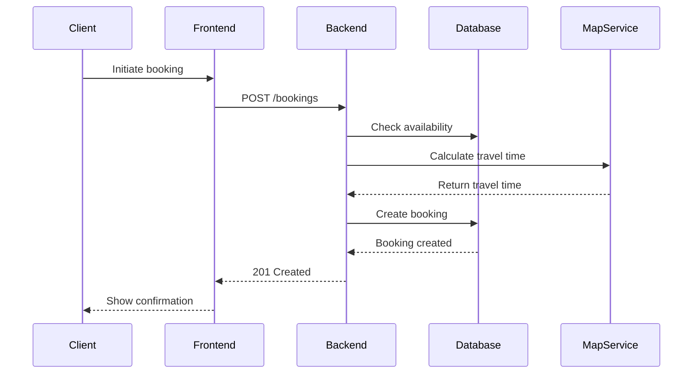
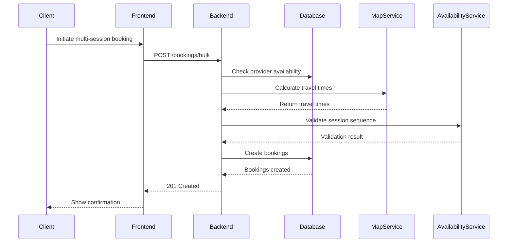
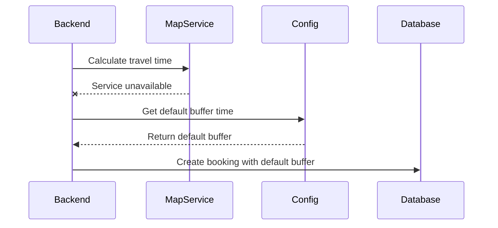

# Booking Flow Documentation

## Sequence Diagrams

### Single Booking Flow


### Multi-session Booking Flow


### Travel Time Fallback Flow


## State Management

### Frontend State
```typescript
interface BookingState {
  date: string;
  time: string;
  duration: number;
  location: {
    lat: number;
    lng: number;
    address: string;
  };
  providerId: string;
  price: number;
  status: 'pending' | 'confirmed' | 'cancelled';
}
```

### Backend State Transitions
1. **Pending**
   - Initial state after creation
   - Can transition to: Confirmed, Cancelled

2. **Confirmed**
   - After payment processing
   - Can transition to: Cancelled

3. **Cancelled**
   - Final state
   - No further transitions

## Error Handling

### Common Error Scenarios
1. **Slot Unavailable**
   - Check availability before booking
   - Return 400 with error message

2. **Invalid Client-Provider Relationship**
   - Verify relationship before booking
   - Return 403 Forbidden

3. **Travel Time Calculation Failure**
   - Fallback to default buffer time
   - Log error for monitoring

## Business Logic

### Pricing Calculation
```typescript
const BASE_RATE = 120; // $120 per hour
const calculatePrice = (duration) => Math.ceil((duration / 60) * BASE_RATE);
```

### Availability Constraints
1. Minimum booking duration: 30 minutes
2. Maximum booking duration: 4 hours
3. Buffer time between bookings: 15 minutes
4. Maximum advance booking: 60 days
