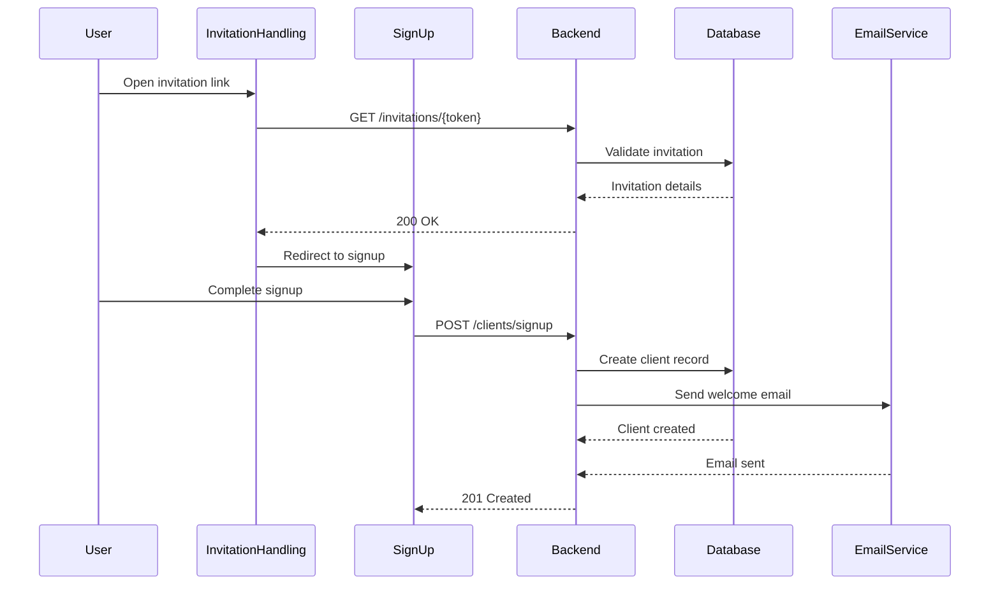

# Client Signup Flow Documentation

## Sequence Diagram



## State Management

### Invitation State
```typescript
interface InvitationState {
  token: string;
  email: string;
  providerId: string;
  isValid: boolean;
  error: string | null;
}
```

### SignUp State
```typescript
interface ClientSignUpState {
  email: string;
  password: string;
  confirmPassword: string;
  firstName: string;
  lastName: string;
  phone: string;
  validationErrors: {
    [key: string]: string;
  };
}
```

## Validation Rules

### Invitation Validation
1. Token must be valid and unexpired
2. Email must match invitation
3. Provider must be active

### SignUp Validation
1. Email must match invitation
2. Password must be at least 8 characters
3. Passwords must match
4. First and last name required
5. Phone number must be valid

## Error Handling

### Common Error Scenarios
1. **Invalid Invitation**
   - Return 410 Gone
   - Show error message
   - Allow request for new invitation

2. **Email Mismatch**
   - Return 400 Bad Request
   - Show error message
   - Prevent signup

3. **Provider Inactive**
   - Return 403 Forbidden
   - Show error message
   - Suggest alternative providers

## Interdependencies

1. **Invitation-Provider Relationship**
   - Provider must be active
   - Provider settings affect invitation validity

2. **Client-Provider Relationship**
   - Client is linked to inviting provider
   - Provider preferences affect client options

3. **Notification System**
   - Provider notified of client signup
   - Client receives welcome email
   - System logs invitation usage
