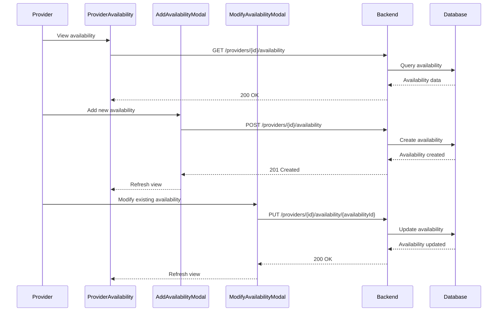

# Provider Availability Management Documentation

## Sequence Diagram



## State Management

### Availability State
```typescript
interface AvailabilityState {
  id: string;
  startTime: string;
  endTime: string;
  daysOfWeek: number[];
  recurrence: 'weekly' | 'biweekly' | 'monthly';
  exceptions: string[];
  isActive: boolean;
}
```

### Modal States
```typescript
interface AddAvailabilityState {
  startTime: string;
  endTime: string;
  days: number[];
  recurrence: string;
  validationErrors: {
    [key: string]: string;
  };
}

interface ModifyAvailabilityState {
  original: AvailabilityState;
  modified: AvailabilityState;
  validationErrors: {
    [key: string]: string;
  };
}
```

## Validation Rules

### Availability Validation
1. Start time must be before end time
2. Minimum session duration: 30 minutes
3. Maximum session duration: 4 hours
4. No overlapping availability slots
5. Must include at least one day of week

## Error Handling

### Common Error Scenarios
1. **Overlapping Availability**
   - Return 409 Conflict
   - Show error message
   - Highlight conflicting slots

2. **Invalid Time Range**
   - Return 400 Bad Request
   - Show error message
   - Suggest valid ranges

3. **Maximum Availability Reached**
   - Return 403 Forbidden
   - Show error message
   - Suggest removing existing slots

## Interdependencies

1. **Booking Constraints**
   - Existing bookings affect availability modification
   - Cancellations create new availability slots

2. **Provider Settings**
   - Working hours affect availability range
   - Service types affect slot duration

3. **Client Preferences**
   - Popular times affect availability recommendations
   - Client history affects slot suggestions
