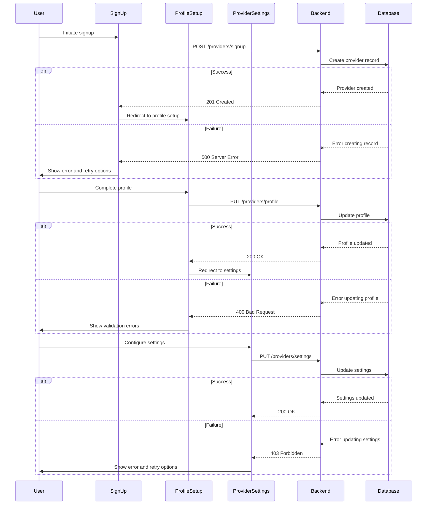

# Provider Signup Flow Documentation

## Sequence Diagram



## Sample Payloads

### SignUp Request
```json
{
  "email": "provider@example.com",
  "password": "securePassword123!",
  "confirmPassword": "securePassword123!",
  "termsAccepted": true
}
```

### Profile Setup Request
```json
{
  "firstName": "John",
  "lastName": "Doe",
  "phone": "+1234567890",
  "address": {
    "street": "123 Main St",
    "city": "Anytown",
    "state": "CA",
    "zip": "12345"
  },
  "certifications": ["LMT", "CPR"],
  "bio": "Experienced massage therapist..."
}
```

### Settings Request
```json
{
  "workingHours": {
    "start": "09:00",
    "end": "18:00"
  },
  "sessionTypes": ["Swedish", "Deep Tissue"],
  "travelRadius": 20,
  "notificationPreferences": {
    "email": true,
    "sms": false
  }
}
```

## State Management

### SignUp State
```typescript
interface SignUpState {
  email: string;
  password: string;
  confirmPassword: string;
  termsAccepted: boolean;
  validationErrors: {
    email?: string;
    password?: string;
    confirmPassword?: string;
    terms?: string;
  };
}
```

### ProfileSetup State
```typescript
interface ProfileSetupState {
  firstName: string;
  lastName: string;
  phone: string;
  address: {
    street: string;
    city: string;
    state: string;
    zip: string;
  };
  certifications: string[];
  bio: string;
  validationErrors: {
    [key: string]: string;
  };
}
```

## Validation Rules

### SignUp Validation
1. Email must be valid and unique
2. Password must be at least 8 characters
3. Passwords must match
4. Terms must be accepted

### Profile Validation
1. First and last name required
2. Phone number must be valid
3. Address must be complete
4. At least one certification required

## Error Handling

### Common Error Scenarios
1. **Email Already Exists**
   - Return 409 Conflict
   - Show error message
   - Allow email change

2. **Invalid Profile Data**
   - Return 400 Bad Request
   - Highlight invalid fields
   - Provide specific error messages

3. **Database Connection Issues**
   - Retry up to 3 times
   - Show maintenance message
   - Log error for monitoring

## Interdependencies

1. **Profile-Settings Relationship**
   - Profile must be complete before settings can be saved
   - Settings validation depends on profile data

2. **Certification Requirements**
   - Minimum certifications required for activation
   - Certification expiration tracking

3. **Availability Constraints**
   - Profile must be complete before setting availability
   - Settings affect availability options
